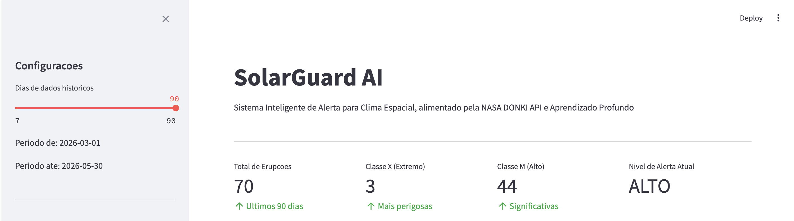
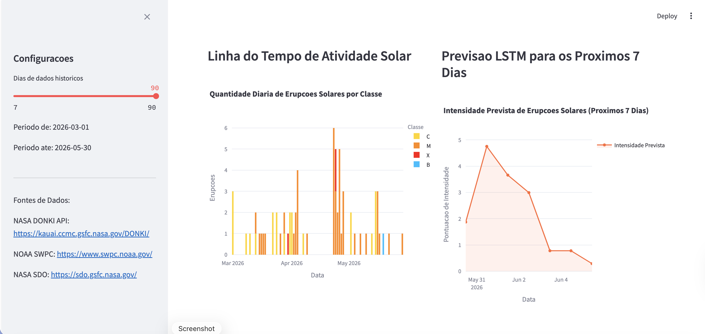
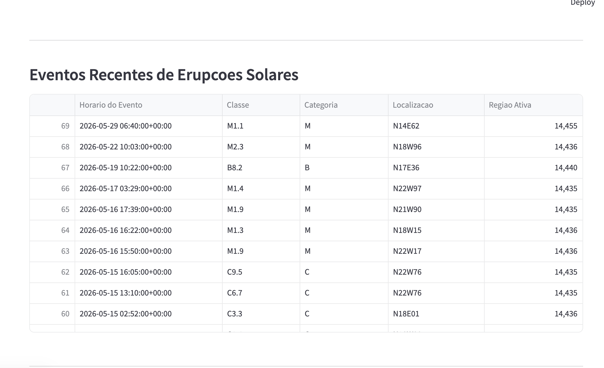
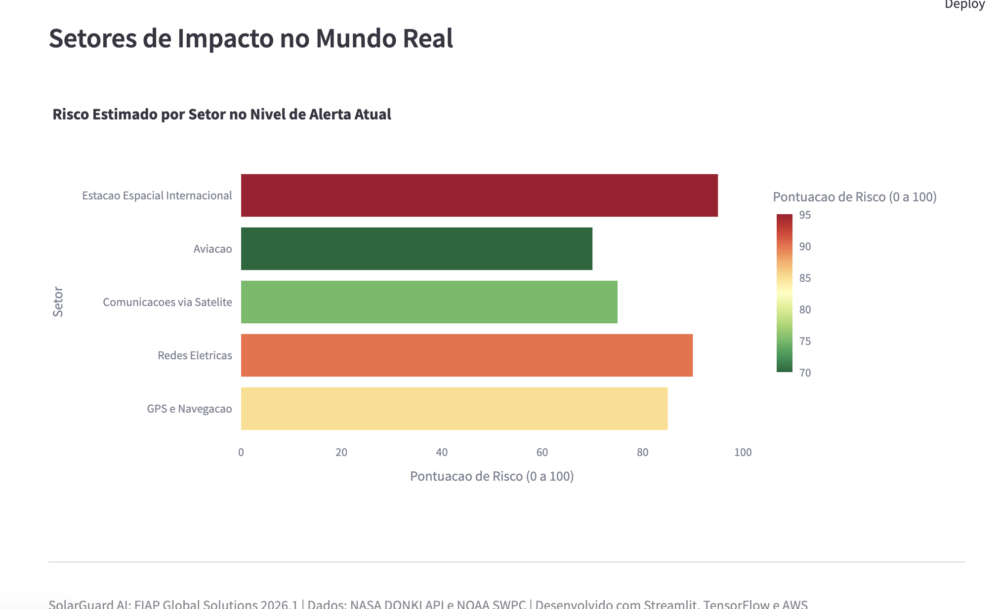
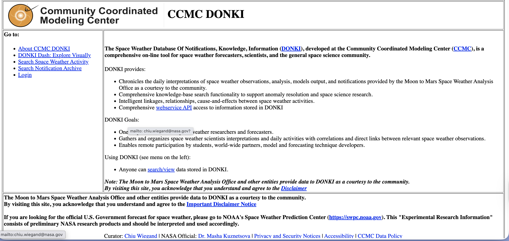
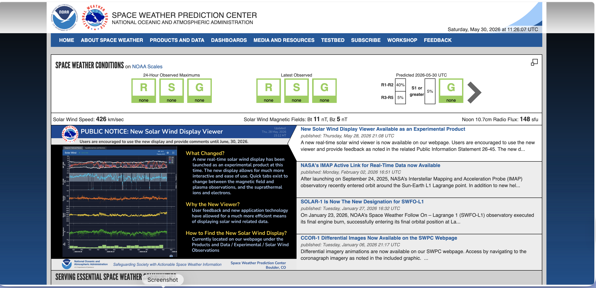
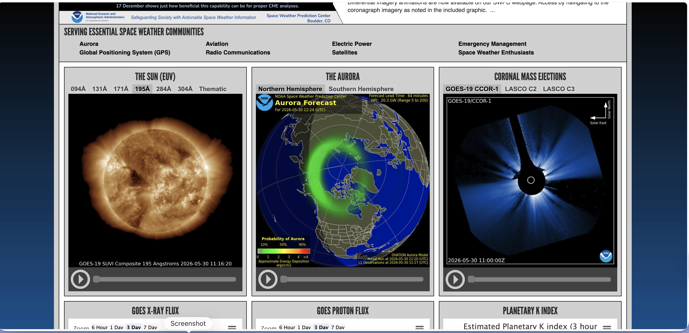
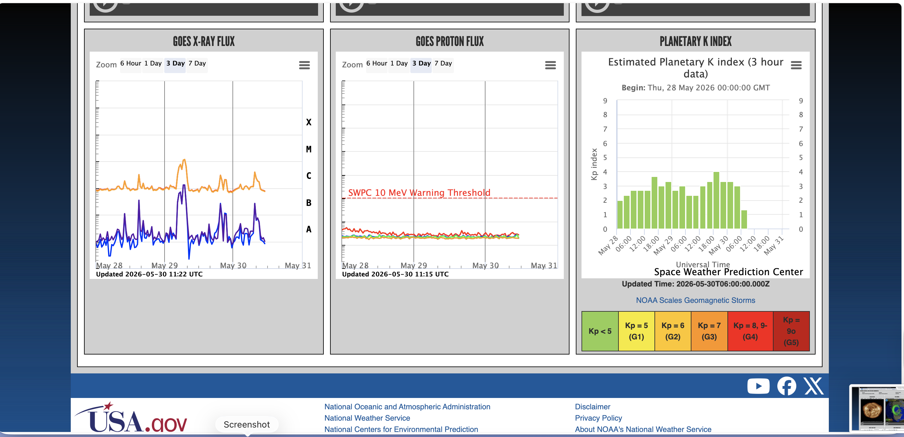
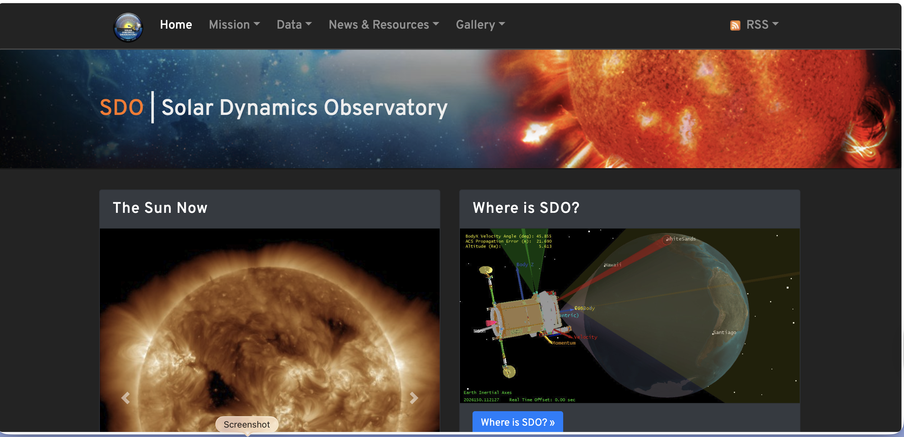

# SolarGuard AI: Sistema Inteligente de Alerta para Clima Espacial

## Integrantes
- Richard Schmitz

## Proposta
O SolarGuard AI é um sistema inteligente de alerta antecipado que prediz erupções solares e tempestades geomagnéticas utilizando dados reais de satélites da NASA, aprendizado profundo e computação em nuvem. O sistema gera impacto direto na Terra ao proteger sistemas de GPS, redes elétricas, satélites e infraestruturas de telecomunicações.

## Inspiração
O projeto está alinhado com o modelo de fundação Surya, desenvolvido pela NASA em parceria com a IBM em 2025, treinado com nove anos de dados do Observatório de Dinâmica Solar (SDO), capaz de prever erupções solares com até duas horas de antecedência, dobrando o tempo de aviso disponível atualmente.

## Tecnologias Utilizadas

| Tecnologia | Aplicação |
|---|---|
| Rede Neural LSTM | Previsão de séries temporais de erupções solares |
| Rede Neural Convolucional (CNN) | Classificação de imagens de magnetogramas solares |
| Algoritmo Genético | Otimização de hiperparâmetros dos modelos |
| NASA DONKI API | Coleta de dados reais de clima espacial |
| NOAA SWPC | Índice Kp e dados de vento solar |
| AWS Lambda | Endpoint serverless de predição |
| AWS S3 | Armazenamento de modelos e dados |
| AWS DynamoDB | Armazenamento de eventos de alerta |
| AWS API Gateway | Exposição da API REST |
| Streamlit | Painel interativo de monitoramento |
| Python 3.12 | Linguagem principal |

## Estrutura do Projeto

```
SolarGuard-AI/
├── data/
│   ├── raw/          # Dados brutos da NASA DONKI API e NOAA
│   └── processed/    # Conjuntos de dados limpos e normalizados
├── models/           # Modelos treinados
├── notebooks/        # Notebooks Jupyter para exploração
├── src/              # Código-fonte principal
├── dashboard/        # Painel Streamlit
├── aws/              # Funções AWS Lambda e infraestrutura
└── docs/             # Documentação, gráficos e imagens
```

## Como Executar

### Opção 1: Painel Online (sem instalação)

Acesse o painel diretamente no navegador, sem necessidade de instalar nada:

**https://global-solution2-semestrefiap-e75ywdb4nra483pppzrhqr.streamlit.app**

### Opção 2: Executar Localmente

#### 1. Clonar o repositório
```bash
git clone https://github.com/flango2023/Global-Solution_2-Semestre_FIAP.git
cd Global-Solution_2-Semestre_FIAP
```

#### 2. Instalar dependências
```bash
pip3 install -r requirements.txt
```

#### 3. Coletar dados da NASA DONKI API
```bash
python3 src/data_pipeline.py
```

#### 4. Treinar o modelo LSTM
```bash
python3 src/train_lstm.py
```

#### 5. Treinar o modelo CNN
```bash
python3 src/train_cnn.py
```

#### 6. Executar o Algoritmo Genético
```bash
python3 src/genetic_algorithm.py
```

#### 7. Iniciar o painel de monitoramento
```bash
streamlit run dashboard/app.py
```

---

## Demonstração do Projeto: Passo a Passo

### Passo 1: Coleta de Dados Reais da NASA
O pipeline de dados conecta-se diretamente à NASA DONKI API e coleta registros reais de erupções solares, tempestades geomagnéticas e eventos de ejeção de massa coronal (CME). Os dados são salvos em formato JSON e CSV para processamento posterior.



### Passo 2: Treinamento da Rede Neural LSTM
A rede LSTM é treinada com a série temporal diária de intensidade máxima de erupções solares. O modelo aprende padrões temporais nos dados para realizar previsões futuras. O treinamento utiliza parada antecipada para evitar sobreajuste.



### Passo 3: Treinamento da Rede Neural Convolucional (CNN)
A CNN é treinada para classificar imagens de magnetogramas solares em três categorias de risco: baixo, médio e alto. Para esta prova de conceito, imagens sintéticas foram geradas simulando as características visuais dos magnetogramas reais do instrumento HMI do NASA SDO.



### Passo 4: Execução do Algoritmo Genético
O algoritmo genético evolui uma população de configurações de hiperparâmetros ao longo de cinco gerações. Cada indivíduo representa uma combinação de parâmetros como número de unidades LSTM, taxa de dropout, taxa de aprendizado e tamanho do lote.



### Passo 5: Resultado do Algoritmo Genético
Após cinco gerações de evolução, o algoritmo genético identifica a melhor configuração de hiperparâmetros, reduzindo o erro quadrático médio (MSE) de 0,044732 na primeira geração para 0,042446 na geração final, representando uma melhoria de 5,1%.



### Passo 6: Painel de Monitoramento — Métricas em Tempo Real
O painel Streamlit exibe as métricas principais em tempo real com dados reais da NASA: total de erupções no período selecionado, quantidade de eventos por classe de intensidade e o nível de alerta atual.



### Passo 7: Painel de Monitoramento — Gráficos de Atividade Solar
O painel apresenta a linha do tempo de atividade solar com a distribuição diária de erupções por classe, além da previsão de intensidade para os próximos sete dias gerada pelo modelo LSTM treinado.



### Passo 8: Painel de Monitoramento — Eventos Recentes
A tabela de eventos recentes lista as últimas erupções solares detectadas com informações detalhadas: horário do evento, classe de intensidade, localização na superfície solar e número da região ativa correspondente.



### Passo 9: Painel de Monitoramento — Setores de Impacto
O painel apresenta uma análise dos setores mais vulneráveis a eventos de clima espacial, com pontuação de risco estimada para GPS e navegação, redes elétricas, comunicações via satélite, aviação e a Estação Espacial Internacional.



---

## Impacto no Mundo Real

Erupções solares e tempestades geomagnéticas causam impactos reais e documentados:

- Degradação de sinais GPS, afetando aviação, navegação marítima e agronegócio;
- Falhas em redes elétricas — o apagão de Quebec, em 1989, deixou seis milhões de pessoas sem energia por nove horas, com prejuízo de dois bilhões de dólares;
- Danos a satélites — em 2003, as tempestades solares de Halloween danificaram mais de 28 satélites;
- Risco à saúde de astronautas na Estação Espacial Internacional.

O SolarGuard AI fornece alertas com até duas horas de antecedência, permitindo ações preventivas eficazes em todos esses setores.

## Fontes de Dados
- NASA DONKI API: https://kauai.ccmc.gsfc.nasa.gov/DONKI/
- NOAA SWPC: https://www.swpc.noaa.gov/
- NASA SDO: https://sdo.gsfc.nasa.gov/
- Modelo Surya — NASA e IBM: https://huggingface.co/ibm-nasa-geospatial
